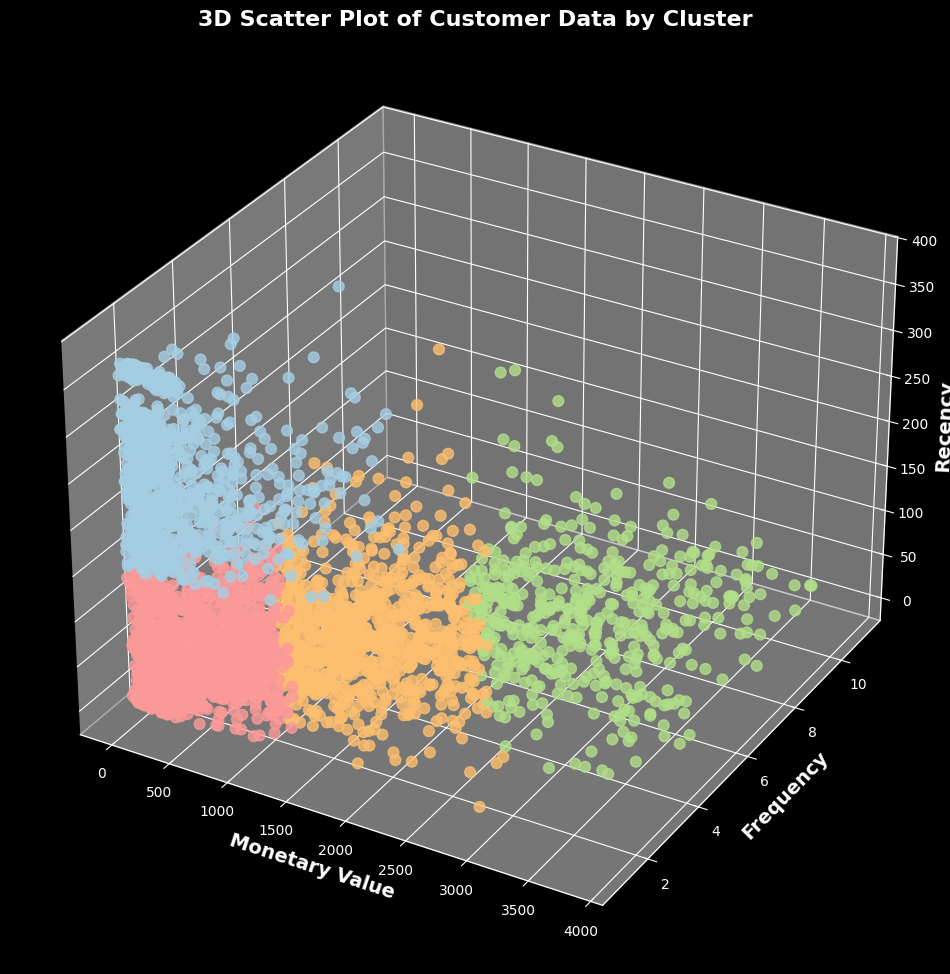
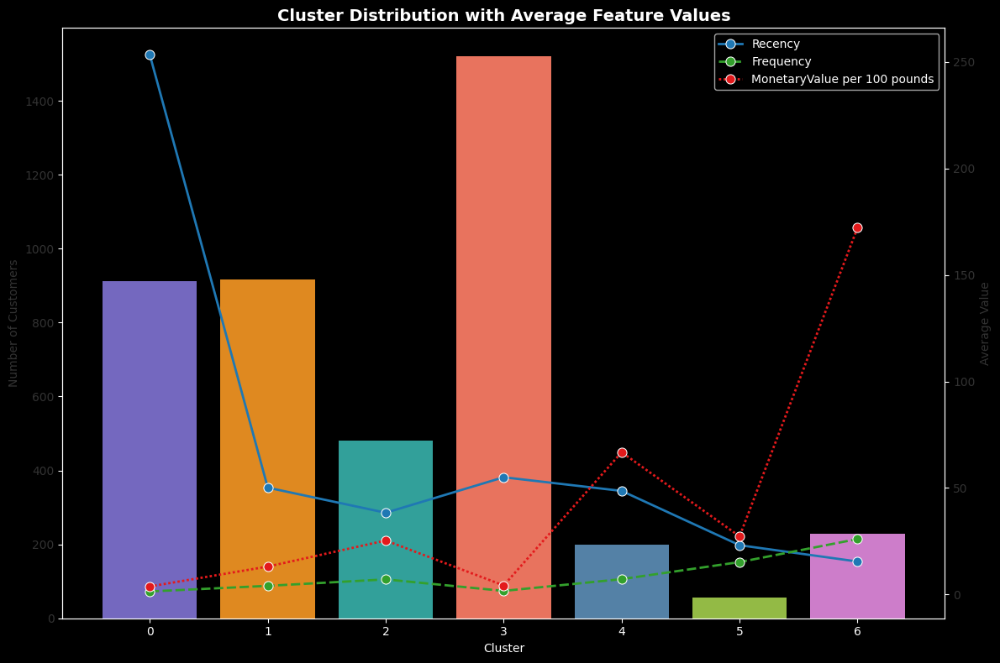

# Customer Segmentation of Online retails

## Project Overview
This project focuses on analyzing customer behavior to segment them into meaningful groups using RFM (Recency, Frequency, Monetary) analysis and clustering techniques. By segmenting customers, businesses can tailor marketing strategies, optimize resources, and enhance customer engagement.

## Objectives
- Segment customers based on their purchasing behavior.
- Identify actionable insights for each customer segment.
- Provide strategies to target each segment effectively.

## Key visualizations

## Key Features
1. **RFM Analysis**: Measuring customer behavior using:
   - **Recency**: How recently a customer purchased.
   - **Frequency**: How often a customer purchased.
   - **Monetary Value**: Total spend of the customer.

2. **Clustering**:
   - Applied clustering algorithms (e.g., K-means) to group customers based on RFM scores.
   - Addressed both regular and outlier clusters for a comprehensive segmentation.

## Data
- **Source**: Customer transaction history.
- **Features**:
   - `CustomerID`: Unique identifier for customers.
   - `Recency`: Days since last purchase.
   - `Frequency`: Total number of purchases.
   - `MonetaryValue`: Total spend amount.

## Cluster Descriptions and Strategies

### **Cluster 0**
- **Description**: Lower-value, infrequent buyers who haven't purchased recently.
- **Strategy**:
   - Targeted marketing campaigns.
   - Offer discounts or reminders to encourage purchases.

### **Cluster 1**
- **Description**: Higher-value, regular buyers but not active recently.
- **Strategy**:
   - Implement loyalty programs.
   - Provide personalized offers to re-engage them.

### **Cluster 2**
- **Description**: Higher-value, very frequent buyers actively purchasing.
- **Strategy**:
   - Offer exclusive deals and promotions.
   - Enhance loyalty programs to sustain engagement.

### **Cluster 3**
- **Description**: Lower-value, infrequent buyers but recent purchasers.
- **Strategy**:
   - Implement retention strategies.
   - Provide better customer service and incentives.

### **Cluster 4**
- **Description**: High spenders with infrequent purchases.
- **Strategy**:
   - Provide personalized luxury offers.
   - Maintain loyalty through tailored experiences.

### **Cluster 5**
- **Description**: Frequent buyers with lower spending per purchase.
- **Strategy**:
   - Introduce bundle deals and upselling opportunities.
   - Encourage higher spending with loyalty programs.

### **Cluster 6**
- **Description**: Top-tier customers with extreme spending and frequent purchases.
- **Strategy**:
   - Develop VIP programs and exclusive rewards.
   - Deliver premium customer experiences.

## Tools & Technologies
- **Python 3.11**
- Libraries: Pandas, NumPy, Seaborn, Matplotlib, Scikit-learn
- Jupyter Notebook

## Workflow
1. **Data Preparation**:
   - Loaded and cleaned transaction data.
   - Computed RFM values for each customer.
2. **Clustering**:
   - Applied clustering algorithms and optimized clusters.
   - Managed outliers with separate outlier cluster groups.
3. **Visualization**:
   - Created cluster-specific visualizations for actionable insights.
4. **Insights & Strategies**:
   - Mapped each cluster to business strategies.

## Future Enhancements
- Incorporate additional customer attributes (e.g., demographics).
- Test other clustering algorithms (e.g., DBSCAN, hierarchical clustering).
- Integrate real-time segmentation with live transaction data.

